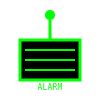
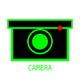

<div align="center">

# ✨ ANIMATED ASSETS - RIFTECH SECURITY SYSTEM

## Asset dengan Efek Animasi

</div>

<hr style="border: 2px solid #00ff00; box-shadow: 0 0 10px #00ff00;">

<br>

Folder `readme_assets/` berisi beberapa file SVG dengan animasi CSS untuk memberikan efek visual yang menarik pada dokumentasi dan presentasi.

<br>

<hr style="border: 2px solid #00ff00; box-shadow: 0 0 10px #00ff00;">

<br>

<div align="center">

## 🎨 IKON ANIMASI (2 FILE) 🎨

</div>

<br>

| File | Deskripsi | Animasi |
|:-----|:---------|:---------:|
| `icon-alarm-animated.svg` | Ikon alarm dengan efek kedipan dan gerakan | ✅ Blink (kedip hijau-kuning), Pulse (bergetar) |
| `icon-camera-animated.svg` | Ikon kamera dengan indikator rekaman | ✅ Blink (kedip merah), Pulse (berdenyut lens) |

<br>

<hr style="border: 2px solid #00ff00; box-shadow: 0 0 10px #00ff00;">

<br>

<div align="center">

## 🔴 ICON-ALARM-ANIMATED.SVG 🔴

</div>

<br>

**Animasi yang diimplementasikan:**

1. **Blink Effect** - Warna kedip antara hijau (#00ff00) dan kuning (#ffff00)
   ```css
   @keyframes blink {
     0%, 100% { fill: #00ff00; }
     50% { fill: #ffff00; }
   }
   ```

2. **Pulse Effect** - Bergetar seperti bell alarm
   ```css
   @keyframes pulse {
     0%, 100% { transform: rotate(-10deg); }
     50% { transform: rotate(10deg); }
   }
   ```

**Penggunaan:**
```markdown

```

**Hasil Visual:**
- 🔔 Bell alarm bergetar kiri-kanan (±10 derajat)
- 🟡 Warna kedip hijau-kuning setiap 0.5 detik
- ⚡ Memberikan kesan alarm aktif

<br>

<hr style="border: 2px solid #00ff00; box-shadow: 0 0 10px #00ff00;">

<br>

<div align="center">

## 📹 ICON-CAMERA-ANIMATED.SVG 📹

</div>

<br>

**Animasi yang diimplementasikan:**

1. **Blink Effect (REC)** - Indikator rekaman berkedip merah
   ```css
   @keyframes blink-rec {
     0%, 100% { fill: #ff0000; opacity: 1; }
     50% { fill: #ff0000; opacity: 0.3; }
   }
   ```

2. **Pulse Effect (Lens)** - Lens kamera berdenyut
   ```css
   @keyframes pulse-lens {
     0%, 100% { opacity: 0.3; }
     50% { opacity: 0.6; }
   }
   ```

**Penggunaan:**
```markdown

```

**Hasil Visual:**
- 🔴 Titik REC berkedip merah (opacity 1-0.3)
- 🔵 Lens kamera berdenyut (opacity 0.3-0.6)
- ⚡ Memberikan kesan kamera sedang merekam

<br>

<hr style="border: 2px solid #00ff00; box-shadow: 0 0 10px #00ff00;">

<br>

<div align="center">

## 📊 TAMPILAN WEB DASHBOARD 📊

</div>

<br>

File `WEB_DASHBOARD_ASCII.txt` berisi representasi ASCII art lengkap dari web dashboard RIFTECH SECURITY SYSTEM.

<br>

<div align="center">

**Struktur Dashboard:**

1. **Live Video Feed** - Tampilan kamera dengan bounding boxes
2. **System Controls** - Tombol [ARM], [REC], [SNAP], [MUTE]
3. **Security Zones** - Visualisasi zona keamanan dengan click-to-draw
4. **Detection Features** - Toggle YOLO, Skeleton, Face, Motion
5. **Keyboard Shortcuts** - A, R, S, M, N, C, Esc

</div>

<br>

**Fitur yang Ditampilkan:**

| Fitur | Deskripsi |
|:------|:---------|
| **FPS Counter** | Menampilkan frame rate real-time (30 FPS) |
| **Person Detection** | Menunjukkan jumlah orang yang terdeteksi (2 persons) |
| **Breach Status** | Menampilkan status pelanggaran (NONE/ACTIVE) |
| **Armed Indicator** | Menampilkan status sistem (TRUE/FALSE) |
| **Recording Status** | Menampilkan status perekaman (ON/OFF) |
| **Zone Visualization** | Menampilkan zona keamanan hexagonal |
| **Zone Info** | Menampilkan jumlah zona dan zona aktif |
| **Intruder Count** | Menampilkan jumlah penyusup di zona |

<br>

**Cara Menggunakan di README.md:**

```markdown
### Web Dashboard

```text
cat WEB_DASHBOARD_ASCII.txt
```
```

Atau langsung include sebagai preformatted text:
```markdown
<pre style="background: #000; color: #00ff00; font-family: 'Courier New', monospace; padding: 20px; border: 2px solid #00ff00;">

╔════════════════════════════════════════╗
║  RIFTECH SECURITY SYSTEM                ║
║  WEB DASHBOARD v2.0                     ║
╚════════════════════════════════════════╝

</pre>
```

<br>

<hr style="border: 2px solid #00ff00; box-shadow: 0 0 10px #00ff00;">

<br>

<div align="center">

## 🎮 SHORTCUTS & CONTROLS 🎮

</div>

<br>

**Keyboard Shortcuts di Web Dashboard:**

| Key | Action | Description |
|:----|:--------|:-----------|
| `A` | Toggle Arm/Disarm | Mengaktifkan/nonaktifkan sistem keamanan |
| `R` | Toggle Recording | Memulai/menghentikan perekaman video |
| `S` | Take Snapshot | Mengambil snapshot kamera |
| `M` | Mute/Unmute | Redam/hidupkan alarm |
| `N` | New Zone | Membuat zona keamanan baru |
| `C` | Clear Zones | Menghapus semua zona keamanan |
| `Esc` | Cancel Drawing | Membatalkan penggambaran zona |

**Tombol UI:**

| Tombol | Action | Description |
|:------|:--------|:-----------|
| `[ARM] SYSTEM` | Mengaktifkan sistem keamanan |
| `[REC]` | Memulai/menghentikan perekaman |
| `[SNAP]` | Mengambil snapshot |
| `[MUTE] ALARM` | Redam/hidupkan alarm |
| `[+] NEW ZONE` | Membuat zona baru |
| `[X] CLEAR ALL` | Menghapus semua zona |
| `[X] YOLO` | Toggle deteksi YOLOv8 |
| `[X] SKELETON` | Toggle pelacakan kerangka |
| `[X] FACE` | Toggle pengenalan wajah |
| `[X] MOTION` | Toggle deteksi gerakan |

<br>

<hr style="border: 2px solid #00ff00; box-shadow: 0 0 10px #00ff00;">

<br>

<div align="center">

## 💡 TIPS PENGGUNAAN 💡

</div>

<br>

### Menggunakan Ikon Animasi

**Untuk Dokumentasi:**
```markdown
### Alarm System


Sistem alarm mendeteksi intrusi dan memberikan peringatan.
```

**Untuk HTML:**
```html
<div class="alarm-indicator">
  
</div>
```

**Untuk CSS:**
```css
.alarm-indicator {
  display: inline-block;
  animation: pulse 2s infinite;
}

@keyframes pulse {
  0%, 100% { opacity: 1; }
  50% { opacity: 0.7; }
}
```

### Menampilkan Web Dashboard

**Option 1: Include langsung di README.md**
```markdown
## Web Dashboard

```text
╔════════════════════════════════════════╗
║  RIFTECH SECURITY SYSTEM                ║
╚════════════════════════════════════════╝
```
```

**Option 2: Link ke file terpisah**
```markdown
## Web Dashboard

Lihat tampilan lengkap [disini](WEB_DASHBOARD_ASCII.txt).
```

**Option 3: Gunakan code block dengan syntax highlighting**
```markdown
```text
╔════════════════════════════════════════╗
║  RIFTECH SECURITY SYSTEM                ║
╚════════════════════════════════════════╝
```
```

<br>

<hr style="border: 2px solid #00ff00; box-shadow: 0 0 10px #00ff00;">

<br>

<div align="center">

## 📄 LISENSI 📄

</div>

<br>

Semua asset animasi dan dokumentasi adalah bagian dari:

**RIFTECH SECURITY SYSTEM**

Copyright 2025 RIFTECH

<br>

<div align="center">

---

**⚡ Asset animasi didesain khusus untuk RIFTECH SECURITY SYSTEM dengan tema cyber hacker ⚡**

---

</div>

</div>
