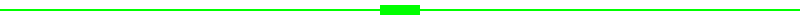

<div align="center">

# 📚 README ASSETS - RIFTECH SECURITY SYSTEM

## Koleksi Visual untuk Dokumentasi

</div>

<hr style="border: 2px solid #00ff00; box-shadow: 0 0 10px #00ff00;">

<br>

Folder `readme_assets/` berisi berbagai file visual yang digunakan untuk dokumentasi dan presentasi RIFTECH SECURITY SYSTEM. Semua file didesain dengan tema cyber hacker yang konsisten.

<br>

<hr style="border: 2px solid #00ff00; box-shadow: 0 0 10px #00ff00;">

<br>

<div align="center">

## 📁 STRUKTUR FILE ASSET 📁

</div>

<br>

```
readme_assets/
├── 🖼️ Ikon Fitur (8 file SVG)
├── 📄 Header SVG (6 file)
├── 🎨 Element SVG (2 file)
└── 📊 Diagram Flow (ASCII art)
```

<br>

<hr style="border: 2px solid #00ff00; box-shadow: 0 0 10px #00ff00;">

<br>

<div align="center">

## 🎨 IKON FITUR (8 SVG) 🎨

</div>

<br>

| File | Deskripsi |
|:-----|:---------|
| `icon-alarm.svg` | Ikon sistem alarm dan peringatan |
| `icon-camera.svg` | Ikon kamera dan video feed |
| `icon-face.svg` | Ikon pengenalan wajah |
| `icon-motion.svg` | Ikon deteksi gerakan |
| `icon-skeleton.svg` | Ikon pelacakan kerangka (skeleton) |
| `icon-telegram.svg` | Ikon integrasi Telegram |
| `icon-yolo.svg` | Ikon deteksi YOLOv8 |
| `icon-zone.svg` | Ikon zona keamanan |

<br>

<div align="center">

**Ikon-ikon ini didesain dengan tema cyber hacker dan dapat digunakan untuk:**
- ❯ Dokumentasi fitur
- ❯ Presentasi sistem
- ❯ Badge dan label
- ❯ Material marketing

**Contoh penggunaan:**
```markdown

```

</div>

<br>

<hr style="border: 2px solid #00ff00; box-shadow: 0 0 10px #00ff00;">

<br>

<div align="center">

## 📄 HEADER SVG (6 FILE) 📄

</div>

<br>

| File | Deskripsi |
|:-----|:---------|
| `header-overview.svg` | Header untuk bagian overview sistem |
| `header-features.svg` | Header untuk bagian fitur |
| `header-installation.svg` | Header untuk bagian instalasi |
| `header-usage.svg` | Header untuk bagian penggunaan |
| `header-deployment.svg` | Header untuk bagian deployment |
| `header-troubleshooting.svg` | Header untuk bagian troubleshooting |

<br>

<div align="center">

**Header-Header ini didesain dengan gaya cyber hacker dan mencakup:**
- ❯ Text dengan emoji dan font monospace
- ❯ Warna hijau neon (#00ff00)
- ❯ Border hijau dengan stroke-width 2
- ❯ Background hitam (#000000)
- ❯ Ukuran viewBox 0 0 400 60

**Contoh penggunaan:**
```markdown

```

</div>

<br>

<hr style="border: 2px solid #00ff00; box-shadow: 0 0 10px #00ff00;">

<br>

<div align="center">

## 🎨 ELEMENT SVG (2 FILE) 🎨

</div>

<br>

| File | Deskripsi |
|:-----|:---------|
| `divider-cyber.svg` | Garis pemisah dengan tema cyber hacker |
| `footer-cyber.svg` | Footer dengan gaya cyber hacker |

<br>

<div align="center">

**Element-element ini digunakan untuk:**
- ❯ Pemisah antar section
- ❯ Footer dokumentasi
- ❯ Decorative separators

**Contoh penggunaan:**
```markdown

```

</div>

<br>

<hr style="border: 2px solid #00ff00; box-shadow: 0 0 10px #00ff00;">

<br>

<div align="center">

## 📊 DIAGRAM FLOW SYSTEM 📊

</div>

<br>

<div align="center">

<pre style="background: #000; color: #00ff00; font-family: 'Courier New', monospace; padding: 20px; border: 2px solid #00ff00; box-shadow: 0 0 20px #00ff00;">

┌──────────────────────────────────────────────────────────────────────────────┐
│                    RIFTECH SECURITY SYSTEM                             │
│                    FLOW DIAGRAM v2.0                                   │
└──────────────────────────────────────────────────────────────────────────────┘

┌─────────────┐    ┌───────────────┐    ┌─────────────────────────────┐
│   CAMERA    │───▶│  PREPROCESS  │───▶│  PARALLEL DETECTION       │
│   INPUT     │    │   FRAME       │    │                         │
└─────────────┘    └───────────────┘    │  ┌────────────────────┐    │
                                       │  │ YOLOv8            │    │
                                       │  │ Person Detection   │    │
                                       │  └────────────────────┘    │
                                       │                           │
                                       │  ┌────────────────────┐    │
                                       │  │ MediaPipe         │    │
                                       │  │ Skeleton Tracking  │    │
                                       │  └────────────────────┘    │
                                       │                           │
                                       │  ┌────────────────────┐    │
                                       │  │ Face Recognition   │    │
                                       │  │ Trusted Persons   │    │
                                       │  └────────────────────┘    │
                                       └─────────────────────────────┘
                                                 │
                                                 ▼
                                  ┌─────────────────────────────┐
                                  │  FUSION RESULTS           │
                                  │  ┌────────────────────┐    │
                                  │  │ Zone Analysis    │    │
                                  │  └────────────────────┘    │
                                  └─────────────────────────────┘
                                                 │
                                                 ▼
                                  ┌─────────────────────────────┐
                                  │  ALERT DISPATCH           │
                                  │  ┌────────────────────┐    │
                                  │  │ Alarm Audio      │    │
                                  │  ├────────────────────┤    │
                                  │  │ Telegram Notif   │    │
                                  │  ├────────────────────┤    │
                                  │  │ Dashboard Update │    │
                                  │  └────────────────────┘    │
                                  └─────────────────────────────┘
                                                 │
                                                 ▼
                                  ┌─────────────────────────────┐
                                  │  STORAGE & LOGGING        │
                                  │  ┌────────────────────┐    │
                                  │  │ SQLite Database   │    │
                                  │  ├────────────────────┤    │
                                  │  │ Video Recording  │    │
                                  │  ├────────────────────┤    │
                                  │  │ Snapshots        │    │
                                  │  └────────────────────┘    │
                                  └─────────────────────────────┘

</pre>

</div>

<br>

<div align="center">

**Diagram ini menunjukkan alur kerja sistem keamanan:**

1. **Camera Input** - Mengambil frame dari kamera
2. **Preprocess Frame** - Menyiapkan frame untuk deteksi
3. **Parallel Detection** - Tiga engine deteksi berjalan bersamaan:
   - YOLOv8: Deteksi orang
   - MediaPipe: Pelacakan kerangka
   - Face Recognition: Identifikasi orang terpercaya
4. **Fusion Results** - Menggabungkan hasil deteksi
5. **Zone Analysis** - Cek intrusi zona keamanan
6. **Alert Dispatch** - Mengirim peringatan:
   - Alarm audio
   - Telegram notification
   - Dashboard update
7. **Storage & Logging** - Menyimpan data:
   - Database SQLite
   - Video recording
   - Snapshots

</div>

<br>

<hr style="border: 2px solid #00ff00; box-shadow: 0 0 10px #00ff00;">

<br>

<div align="center">

## 🎨 PALETA WARNA CYBER HACKER 🎨

</div>

<br>

Semua asset menggunakan palet warna yang konsisten:

| Warna | Hex Code | CSS Variable | Penggunaan |
|:-----:|:---------|:-------------|:-----------|
| **Hijau Neon** | `#00ff00` | `--cyber-green` | Text utama, border, glow |
| **Hijau Gelap** | `#008800` | `--cyber-green-dark` | Background tombol hover |
| **Cyan** | `#00ffff` | `--cyber-cyan` | Highlight, secondary text |
| **Merah** | `#ff0000` | `--cyber-red` | Alert, peringatan, breach |
| **Kuning** | `#ffff00` | `--cyber-yellow` | Warning, mute status |
| **Biru** | `#0088ff` | `--cyber-blue` | Recording indicator |
| **Hitam** | `#000000` | `--cyber-black` | Background utama |
| **Dark** | `#050505` | `--cyber-darker` | Panel background |

<br>

<hr style="border: 2px solid #00ff00; box-shadow: 0 0 10px #00ff00;">

<br>

<div align="center">

## 📝 CARA MENGGUNAKAN ASSET 📝

</div>

<br>

### Di Markdown (README.md)

```markdown

```

Contoh:
```markdown


```

### Di HTML

```html

```

### Di CSS

```css
.cyber-icon {
    background: url('readme_assets/icon-alarm.svg') no-repeat center;
    width: 50px;
    height: 50px;
}
```

### Di Python

```python
from pathlib import Path

assets_dir = Path("readme_assets")
icon_path = assets_dir / "icon-alarm.svg"

# Gunakan icon_path untuk menyertakan asset di dokumentasi
```

<br>

<hr style="border: 2px solid #00ff00; box-shadow: 0 0 10px #00ff00;">

<br>

<div align="center">

## 🛠️ TIPS KUSTOMISASI 🛠️

</div>

<br>

### Mengubah Warna

Buka file SVG dan ubah hex color:
```xml
<svg fill="#00ff00" stroke="#00ff00">
```

### Mengubah Ukuran

Di Markdown:
```markdown

```

Di HTML:
```html

```

### Mengubah Text

Edit tag `<text>` di file SVG:
```xml
<text x="50" y="90" fill="#00ff00" font-family="monospace">TEKS BARU</text>
```

### Mengubah Emoji

Edit emoji di file header SVG:
```xml
<text x="200" y="38">🆕 HEADER BARU 🆕</text>
```

<br>

<hr style="border: 2px solid #00ff00; box-shadow: 0 0 10px #00ff00;">

<br>

<div align="center">

## 📄 LISENSI ASSET 📄

</div>

<br>

Semua asset dalam folder `readme_assets/` adalah bagian dari:

**RIFTECH SECURITY SYSTEM**

Copyright 2025 RIFTECH

<br>

<div align="center">

---

**⚡ Asset-asset ini didesain khusus untuk RIFTECH SECURITY SYSTEM dengan tema cyber hacker ⚡**

---

</div>

</div>
